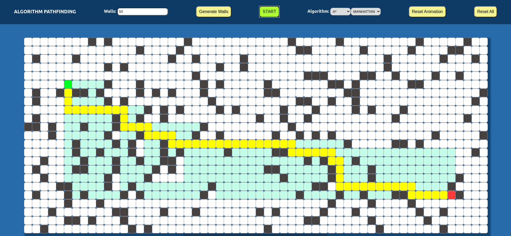

# Pathfinding visualizer 

https://nicolosponziello.github.io/pathfinding-visualizer-react/

Pathfinding visualizer made with React + TypeScript

Implemented algorithms:
- Breadth-first-search
- Depth-first-search
- Dijkstra
- A*
    - Manhattan
    - Euclidean
    - Diagonal

Maze generation based on algorithms mentioned here

https://medium.com/analytics-vidhya/maze-generations-algorithms-and-visualizations-9f5e88a3ae37

and here

https://github.com/theJollySin/mazelib
